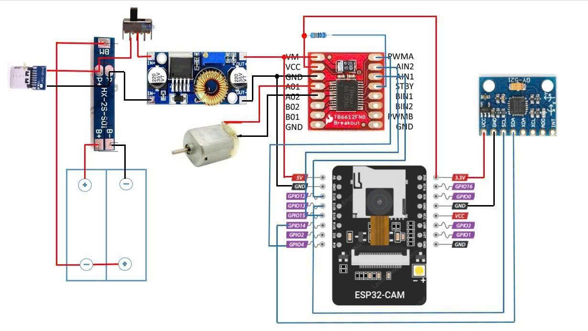
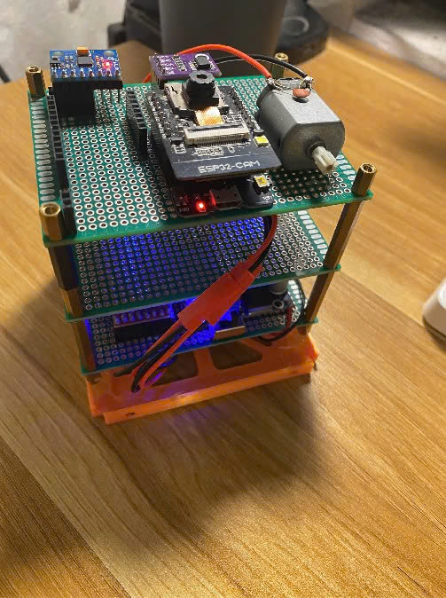
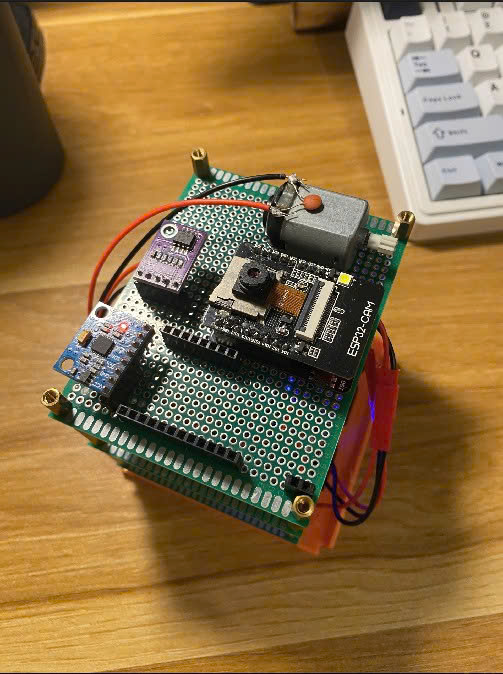

# Cubesat
*Develop a dashboard for visualizing telemetry data and snapshot from a CubeSat*

---
## 1. Hardware
The hardware was designed as shown in the bellowing figure:

  

**Includes**
- 1x Controller esp32-cam
- 1x Sensor MPU6050
- 1x TB6612FNG driver
- 1x motor
- 1x lithium protection battery circuit
- 1x Module DC-DC LX4005
- 2x lithium 18650

This is cubesat that made by myself

<table>
  <tr>
    <td align="center">
      
       
    </td>
    <td align="center">
      
       
    </td>
  </tr>
</table>

## 